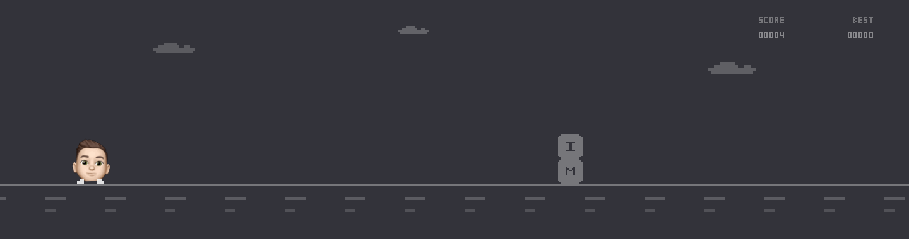

# Pixel Run

The small game at the bottom of [miguelclavel.com](https://miguelclavel.com/?utm_source=github&utm_medium=pixel-run), for anyone who gets that far. My face runs, blocks come at you from the right, and you jump them. Look closely: each block is a letter, and together they spell my name.

<picture>
  <source media="(prefers-color-scheme: dark)" srcset="assets/pixel-run-dark.png">
  
</picture>

**[Play it](https://miguelclavel.github.io/pixel-run-game/)** · Space, a click, or a tap jumps. When nobody's playing, it plays itself.

## Why a game in a footer

A footer is where people land when they're done. Either they leave, or you give them a reason to stay ten more seconds. It makes the page feel like somebody actually lives there.

The physics are four numbers. Gravity pulls down hard, the jump pushes up a little less hard, and the world starts at a walking pace then ramps to more than twice that. Tuning those four against each other is the whole game design. Too floaty and it's boring, too heavy and it's unfair.

## Put it on your site

One file, React 18 from a CDN, no build step.

```html
<div id="game" style="aspect-ratio: 1440 / 380"></div>

<script crossorigin src="https://cdnjs.cloudflare.com/ajax/libs/react/18.3.1/umd/react.production.min.js"></script>
<script crossorigin src="https://cdnjs.cloudflare.com/ajax/libs/react-dom/18.3.1/umd/react-dom.production.min.js"></script>
<script src="pixel-run-game.js"></script>
<script>
  ReactDOM.createRoot(document.getElementById("game"))
    .render(React.createElement(PixelRunGame, { background: "#33333A" }));
</script>
```

Using React already? Load `pixel-run-game.js` and render `<PixelRunGame />` like any component.

### Options

| Prop | Default | What it does |
| --- | --- | --- |
| `background` | `"#00164C"` | Colour behind the game |
| `ink` | `"#ffffff"` | Colour of the ground, blocks, clouds and score |
| `startSpeed` | `420` | How fast the world moves at the start |
| `maxSpeed` | `980` | Top speed it ramps up to |
| `gravity` | `4780` | How hard the runner falls |
| `jump` | `1480` | How hard the runner jumps |
| `showHud` | `true` | Show the score and best score |
| `attract` | `true` | Play itself while nobody is playing |
| `farDashSpeed` | `100` | Speed of the far road markings |

My site uses `background: "#33333A"` in light mode and `"#04040A"` in dark, with the defaults above for everything else.

### Use your own face

The runner's head is an animated GIF: `face.gif` is my Memoji on a 640 by 480 transparent canvas. Point it at yours before the script loads, and tell it where the face sits in the image:

```html
<script>
  window.PIXEL_RUN_FACE = "my-face.gif";
  window.PIXEL_RUN_FACE_CROP = { x: 186, y: 42, w: 272, h: 288 };
</script>
```

No image at all and the runner simply runs without a head.

To spell your own name on the blocks, edit the 8 by 8 letter grids near the top of `pixel-run-game.js`.

## Or build your own from a prompt

Copy it as it is and paste it into Claude, or any AI coding tool.

```text
Build a small side scrolling runner in the footer of my page. The character jumps on space or click, with gravity so the jump arcs. Blocks scroll in from the right and the run ends on a hit. Draw each block as a letter from my name, defined as an 8 by 8 grid of on and off pixels in the code, one letter per block. Start the world slow and ramp the speed up to roughly double over a run. Show the current score and the best score of the session. When nobody has played for a while, let the game play itself in the background.
```

More like this in [interaction-recipes](https://github.com/miguelclavel/interaction-recipes).

---

MIT licensed. Made by [Miguel Clavel](https://miguelclavel.com/?utm_source=github&utm_medium=pixel-run) with Claude Code. Fair warning, I've lost more time to this than I'll admit.
